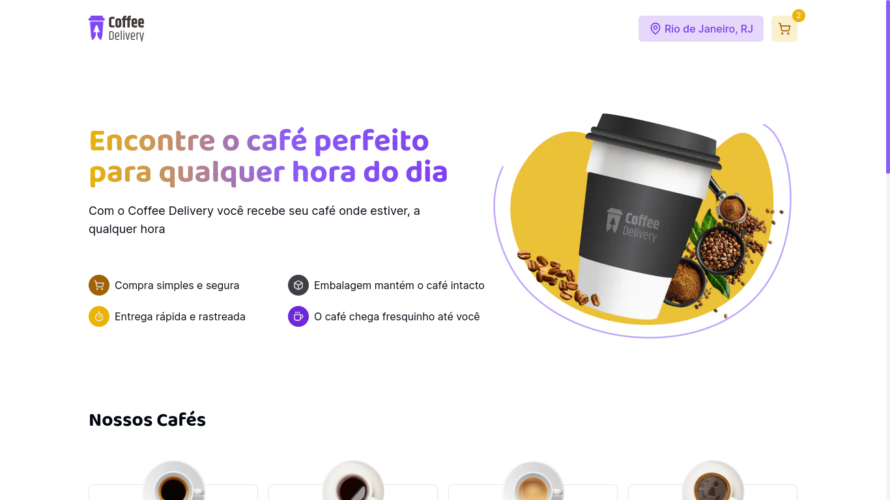

<div align="center">
  
</div>

<br />

<div align="center">
   
</div>

## :dart: Sobre

O Coffee Delivery foi baseado em um desafio proposto pela Rocketseat, sendo concebido com o propósito de solidificar meus conhecimentos nas atuais tecnologias que estou utilizando.

Hospedagem: <a href="https://dev-coffeedelivery.vercel.app/" target="_blank">Coffee Delivery Website</a>

## :rocket: Tecnologias

- <a href="https://reactjs.org/" target="_blank">React.js</a>
- <a href="https://nextjs.org/" target="_blank">Next.js</a>
- <a href="https://tailwindcss.com/" target="_blank">Tailwind CSS</a>
- <a href="https://www.radix-ui.com/" target="_blank">Radix UI</a>
- <a href="https://www.react-hook-form.com/" target="_blank">React Hook Form</a>
- <a href="https://zod.dev/" target="_blank">Zod</a>
- <a href="https://zustand-demo.pmnd.rs/" target="_blank">Zustand</a>

## :game_die: Rodando o app

```bash

# Clone este repositório
$ git clone git@github.com:JoaoManoelDev/coffee-delivery.git

# Acesse a pasta do projeto no terminal/cmd
$ cd coffee-delivery

# Instale as dependências
$ npm install

# Execute a aplicação em modo de desenvolvimento
$ npm run dev

# O servidor inciará na porta:3000 - acesse http://localhost:3000

```

Feito com ❤️ por João Manoel
